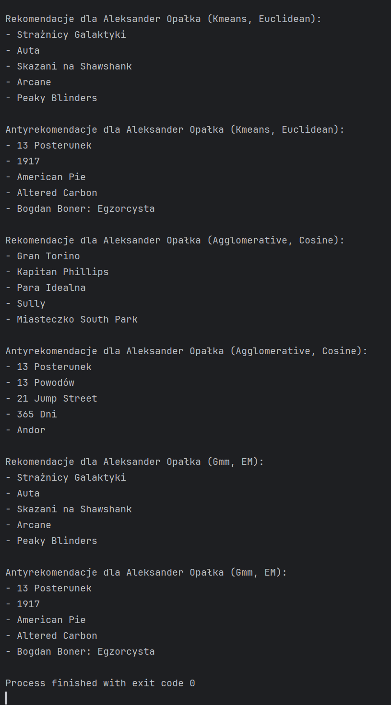
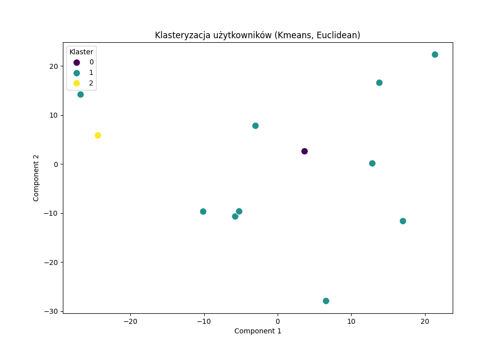
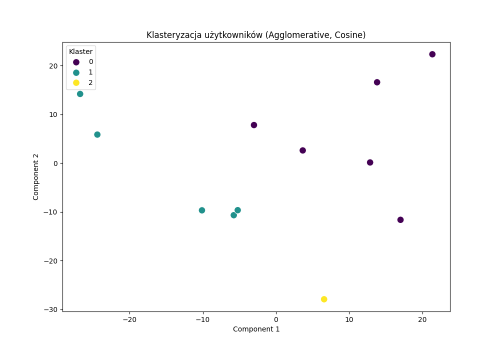

# Rekomendator Filmów - Aleksander Opałka


## Opis Projektu

Rekomendator Filmów to aplikacja wykorzystująca algorytmy klasteryzacji (K-Means, Agglomerative Clustering, GMM) do grupowania użytkowników na podstawie ich ocen filmów. Dzięki temu system może zidentyfikować podobnych użytkowników, co pozwala na bardziej precyzyjne generowanie rekomendacji filmowych. 

### Jak to działa:
1. **Zbieranie Danych:** Aplikacja pobiera dane użytkowników wraz z ich ocenami różnych filmów.
2. **Przetwarzanie Danych:** Oceny są przekształcane w macierz użytkownik-film, gdzie wiersze reprezentują użytkowników, a kolumny filmy. Brak oceny jest uzupełniany zerem.
3. **Klasteryzacja:** 
    - **K-Means:** Grupuje użytkowników na podstawie podobieństwa ich ocen, minimalizując odległości wewnątrz klastrów.
    - **Agglomerative Clustering:** Hierarchiczna metoda łącząca użytkowników w klastery na podstawie metryki kosinusowej, co jest szczególnie przydatne przy wykrywaniu bardziej złożonych wzorców.
    - **Gaussian Mixture Models (GMM):** Umożliwia modelowanie klastrów jako mieszanin rozkładów normalnych, co pozwala na bardziej elastyczne kształty klastrów.
4. **Generowanie Rekomendacji:** Na podstawie przynależności użytkownika do konkretnego klastra, system analizuje średnie oceny filmów w tym klastrze i rekomenduje filmy, które użytkownik jeszcze nie oglądał, ale są wysoko oceniane przez jego klaster.
5. **Generowanie Antyrekomendacji:** System również identyfikuje filmy, które są nisko oceniane przez klaster użytkownika, sugerując, że użytkownik prawdopodobnie nie będzie ich zainteresowany.

## Użycie

1. **Przygotuj dane:**

    Upewnij się, że plik `dane_filmy.json` znajduje się w folderze `data/` i jest poprawnie sformatowany.

2. **Uruchom aplikację:**

    ```bash
    python main.py
    ```

3. **Wybierz użytkownika:**

    Po uruchomieniu skryptu wybierz numer użytkownika, dla którego chcesz wygenerować rekomendacje.

## Przykłady użycia:





## Opis algorytmów klasteryzacji:

### K-Means

**Opis:**
K-Means to jeden z najpopularniejszych algorytmów klasteryzacji. Jego celem jest podział zbioru danych na K klastrów, w taki sposób, aby suma kwadratów odległości między punktami a ich centroidami była minimalna.

**Jak działa:**
1. **Inicjalizacja:** Losowo wybiera się K punktów jako początkowe centroidy klastrów.
2. **Przypisanie:** Każdy użytkownik jest przypisywany do najbliższego centroidu na podstawie wybranej metryki odległości (np. euklidesowej).
3. **Aktualizacja:** Centroidy są aktualizowane jako średnie pozycje wszystkich użytkowników przypisanych do danego klastra.
4. **Powtórzenie:** Proces przypisania i aktualizacji jest powtarzany aż do osiągnięcia stabilności, czyli gdy centroidy przestają się zmieniać.

**Zalety:**
- Szybki i efektywny dla dużych zbiorów danych.
- Łatwy do implementacji i zrozumienia.

**Wady:**
- Wymaga z góry określenia liczby klastrów K.
- Czuły na wybór początkowych centroidów.
- Zakłada klastrowanie w przestrzeni euklidesowej, co może być ograniczeniem dla bardziej złożonych danych.

### Agglomerative Clustering

**Opis:**
Agglomerative Clustering to metoda hierarchicznej klasteryzacji, która buduje drzewiastą strukturę klastrów poprzez łączenie najbardziej podobnych klastrów.

**Jak działa:**
1. **Inicjalizacja:** Każdy użytkownik zaczyna jako oddzielny klaster.
2. **Łączenie:** Iteracyjnie łączy się dwa najbardziej podobne klastery na podstawie wybranej metryki odległości (np. kosinusowej) i kryterium łączenia (np. średniego połączenia).
3. **Powtórzenie:** Proces łączenia jest kontynuowany aż do osiągnięcia żądanej liczby klastrów.

**Zalety:**
- Nie wymaga określenia liczby klastrów z góry.
- Może wykrywać bardziej złożone struktury klastrów w danych.
- Elastyczny w wyborze metryki odległości i kryterium łączenia.

**Wady:**
- Wolniejszy dla dużych zbiorów danych w porównaniu do K-Means.
- Może być podatny na wybór metryki odległości i kryterium łączenia.

### Gaussian Mixture Models (GMM)

**Opis:**
Gaussian Mixture Models to probabilistyczny model klasteryzacji, który zakłada, że dane są generowane przez mieszankę wielu rozkładów normalnych (Gaussa).

**Jak działa:**
1. **Inicjalizacja:** Określa się liczbę komponentów (klastrów) oraz początkowe parametry rozkładów normalnych.
2. **E-step (Expectation):** Oblicza się prawdopodobieństwo przynależności każdego użytkownika do każdego klastra na podstawie bieżących parametrów modelu.
3. **M-step (Maximization):** Aktualizuje się parametry rozkładów normalnych (średnie, kowariancje) na podstawie obliczonych prawdopodobieństw.
4. **Powtórzenie:** Proces E-step i M-step jest powtarzany aż do konwergencji, czyli gdy zmiany parametrów stają się minimalne.

**Zalety:**
- Elastyczny w modelowaniu klastrów o różnych kształtach i rozmiarach.
- Dostarcza probabilistyczne przypisanie użytkowników do klastrów, co może być bardziej informacyjne.
- Może lepiej dopasować się do skomplikowanych struktur danych w porównaniu do K-Means.

**Wady:**
- Może być bardziej podatny na lokalne minima w porównaniu do K-Means.
- Wymaga z góry określenia liczby klastrów oraz rodzaju macierzy kowariancji.
- Może być wolniejszy dla bardzo dużych zbiorów danych.
