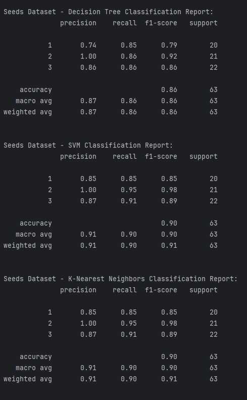
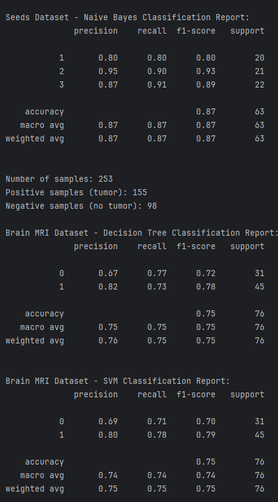
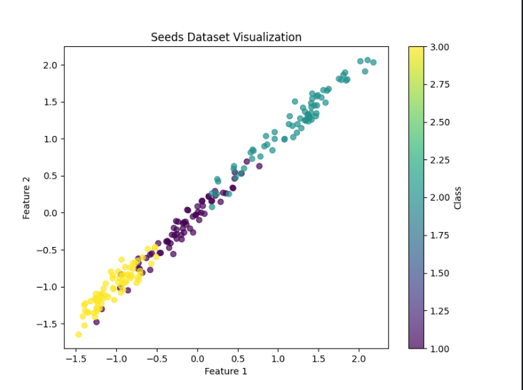

# Klasyfikatory i wizualizacja - Aleksander Opałka

## Data used sources:

- Seeds_dataset.txt - 9 chapter - https://machinelearningmastery.com/standard-machine-learning-datasets/
- brain_tumor_data - https://www.kaggle.com/datasets/navoneel/brain-mri-images-for-brain-tumor-detection

### Porównanie Klasyfikatorów użytych w projekcie

| **Klasyfikator**       | **Zalety**                                   | **Wady**                           |
|-------------------------|---------------------------------------------|------------------------------------|
| **Decision Tree**       | Intuicyjny, łatwy w interpretacji           | Może ulec przeuczeniu             |
| **SVM**                 | Skuteczny dla małych zbiorów, elastyczny    | Wolny na dużych zbiorach          |
| **KNN**                 | Prosty, intuicyjny                         | Powolny, wrażliwy na skalę danych |
| **Naive Bayes**         | Bardzo szybki, działa z dużymi zbiorami     | Naiwne założenia niezależności    |

### Analiza wyników klasyfikatorów

Funkcja `evaluate_classifiers` trenuje i ocenia klasyfikatory na dostarczonych danych, a wydruki `print` dostarczają następujących informacji:

- **Skuteczność:** Jak dobrze dany klasyfikator radzi sobie na zbiorze danych.
- **Metryki:** Precision, Recall, F1-score i Support dla każdej klasy.
- **Porównanie:** Który klasyfikator lepiej pasuje do konkretnego zbioru danych.
- **Problemy:** Wskazanie błędów klasyfikacji (np. fałszywe pozytywy/negatywy).
- **Wpływ danych:** Jak dane i etykiety wpływają na wyniki klasyfikatorów.

Raporty pozwalają zrozumieć różnice między klasyfikatorami i ich dopasowanie do analizowanego problemu.

### Metryki:
1. **Precision (Precyzja):**
   - Odsetek próbek przypisanych do danej klasy, które faktycznie należą do tej klasy.
   - Wysoka precyzja oznacza mniej fałszywych alarmów.

2. **Recall (Czułość):**
   - Odsetek próbek danej klasy, które zostały poprawnie wykryte.
   - Wysoki recall oznacza, że klasyfikator dobrze wykrywa rzeczywiste przypadki danej klasy.

3. **F1-Score:**
   - Średnia harmoniczna Precision i Recall.
   - Pokazuje równowagę między precyzją a czułością.

4. **Support:**
   - Liczba rzeczywistych próbek należących do każdej klasy w zbiorze danych.

## Zdjecia przykładowe, ukazujące działanie programu:

## Wizualizacja danych dla nasion:

