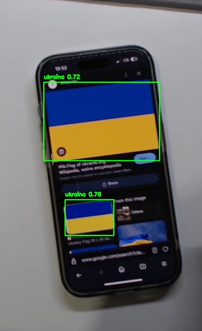
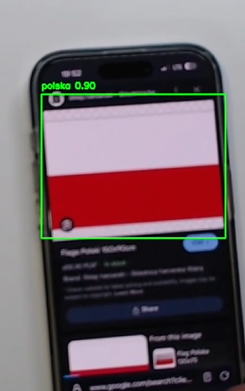

## Detekcja Flag (Polska, Rosja, Ukraina) przy użyciu YOLOv8

### Aleksander Opałka s24399-pj

### Opis projektu

Projekt ma na celu wykrywanie i rozróżnianie flag trzech krajów:

    Polski (biało-czerwona),
    Rosji (biało-niebiesko-czerwona),
    Ukrainy (niebiesko-żółta).

Model został wytrenowany przy użyciu YOLOv8 (Ultralytics). Dodatkowo, w zbiorze danych pojawiają się także obrazy negatywne (bez flag), aby model nauczył się sytuacji, w której nie występuje żaden obiekt.

## Trening Modelu

```yolo detect train model=yolov8n.pt data=data.yaml epochs=50 batch=8 name=flag_detection device="cuda:0"```

## Detekcja w Czasie Rzeczywistym użycie kamery

W pliku scripts/detect_realtime.py możesz analogicznie wczytać model i przekazywać klatki z kamerki.

## Przykłady:


